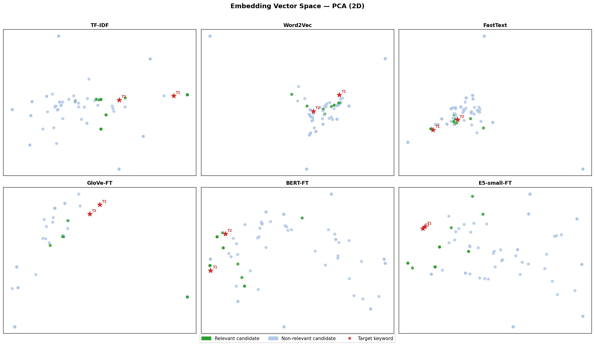
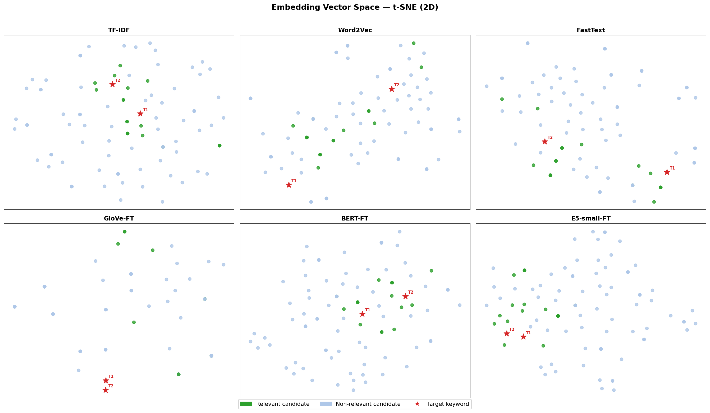
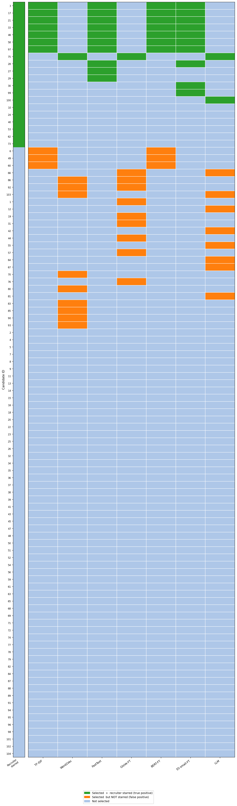

# Talent Spotting & Candidate Ranking System

> Automatically surface the most promising Human Resources candidates from a pool of applicants — using a progression of NLP embedding techniques, a blended scoring model, and an LLM re-ranker — so recruiters spend their time on the right people.

---

## Table of Contents

1. [Project Overview](#1-project-overview)
2. [Problem Statement](#2-problem-statement)
3. [Project Pipeline — Step by Step](#3-project-pipeline--step-by-step)
   - [Step 1 — Data Loading](#step-1--data-loading)
   - [Step 2 — Data Cleaning & Preprocessing](#step-2--data-cleaning--preprocessing)
   - [Step 3 — Embedding & Similarity Scoring](#step-3--embedding--similarity-scoring)
   - [Step 4 — Candidate Ranking](#step-4--candidate-ranking)
   - [Step 5 — Re-ranking with Recruiter Feedback](#step-5--re-ranking-with-recruiter-feedback)
   - [Step 6 — LLM-based Scoring](#step-6--llm-based-scoring)
   - [Step 7 — Evaluation](#step-7--evaluation)
   - [Step 8 — Visualization](#step-8--visualization)
4. [Embedding Methods Compared](#4-embedding-methods-compared)
5. [Key Design Decisions](#5-key-design-decisions)
6. [Project Structure](#6-project-structure)
7. [How to Run](#7-how-to-run)
8. [Results & Visualizations](#8-results--visualizations)
9. [Concluding Remarks for Hiring Managers & Recruiters](#9-concluding-remarks-for-hiring-managers--recruiters)

---

## 1. Project Overview

This project builds an end-to-end **intelligent candidate ranking system** for a recruiting use case. Given a dataset of candidates with job titles and LinkedIn connection counts, the system ranks them by how well they fit the profile of someone *aspiring to or seeking a Human Resources role*.

The project systematically benchmarks **six embedding strategies** — from classical bag-of-words to state-of-the-art transformer models — and demonstrates how each technique's strengths and weaknesses affect real-world ranking quality. A small language model (Qwen2.5-0.5B-Instruct) is also used as an independent scorer, and all methods are evaluated against a recruiter-provided ground truth.

---

## 2. Problem Statement

A recruiter has a pool of candidates and two target search phrases:

- `"aspiring human resources"`
- `"seeking human resources"`

**Goal:** Automatically rank every candidate by their fit for an HR role, so the recruiter's most relevant candidates appear at the top of the list.

**Challenges addressed:**
- Job titles are short, noisy, and varied in phrasing
- Simple keyword matching misses semantically equivalent titles (e.g. `"HR"` vs `"Human Resources"`)
- Longer titles dilute keyword signals in bag-of-words models
- Connection count is a weak signal that should be blended in, not dominate
- Recruiter feedback (starred candidates) can be used to continuously improve rankings

---

## 3. Project Pipeline — Step by Step

```
Raw CSV Data
     │
     ▼
┌─────────────────┐
│  Data Loading   │  load_data()
└────────┬────────┘
         │
         ▼
┌─────────────────────────────┐
│  Cleaning & Preprocessing   │  preprocess()
│  - Clean job titles         │
│  - Parse connection counts  │
│  - Normalize connections    │
└────────────┬────────────────┘
             │
             ▼
┌────────────────────────────────────────┐
│  Embedding & Similarity Scoring        │  compare_embeddings.py
│  (6 methods benchmarked in parallel)   │
│  TF-IDF → Word2Vec → FastText →        │
│  GloVe-FT → BERT-FT → E5-small-FT     │
└────────────┬───────────────────────────┘
             │
             ▼
┌──────────────────────────────────────┐
│  Candidate Ranking                   │  ranking.py
│  fit = 0.7 × title_sim               │
│       + 0.3 × connections_norm       │
└────────────┬─────────────────────────┘
             │
             ▼
┌──────────────────────────────────────┐
│  Re-ranking with Recruiter Feedback  │  reranking.py
│  Blend similarity-to-starred into    │
│  the fit score (α = 0.9)             │
└────────────┬─────────────────────────┘
             │
             ▼
┌──────────────────────────────────────┐
│  LLM Scoring                         │  llm_ranking.py
│  Qwen2.5-0.5B-Instruct scores each   │
│  title 0.0–1.0 for HR fit            │
└────────────┬─────────────────────────┘
             │
             ▼
┌──────────────────────────────────────┐
│  Evaluation & Visualization          │  evaluation.py
│  NDCG@k · PCA · t-SNE · Score Grid  │
└──────────────────────────────────────┘
```

---

### Step 1 — Data Loading

**File:** `src/data_loader.py`

The raw dataset (`data/PotentialTalents.csv`) contains candidate records with:
- `id` — unique candidate identifier
- `job_title` — free-text LinkedIn-style job title
- `connection` — LinkedIn connection count (may include `"500+"`)

---

### Step 2 — Data Cleaning & Preprocessing

**File:** `src/preprocessing.py`

| Operation | Detail |
|---|---|
| Job title cleaning | Preserved as-is for transformer models (BERT/E5 handle casing and punctuation internally); classical models receive the raw title |
| Connection parsing | `"500+"` is capped at 500; invalid values default to 0 |
| Connection normalization | Scaled to `[0, 1]` by dividing by 500 |

The preprocessing module exposes `TARGETS_CLEAN` — the cleaned versions of the two target keywords — which are reused consistently across all embedding methods.

---

### Step 3 — Embedding & Similarity Scoring

**File:** `src/compare_embeddings.py`

This is the analytical core of the project. Each of the six methods follows an identical contract:

1. Embed all candidate job titles → matrix of shape `(n_candidates × dim)`
2. Embed the target keywords → matrix of shape `(n_targets × dim)`
3. Compute cosine similarity between every candidate and every target
4. Take the **maximum** similarity per candidate as their raw fit score

This produces a single scalar `fit` score per candidate for each method, enabling a direct comparison.

---

### Step 4 — Candidate Ranking

**File:** `src/ranking.py`

Raw embedding similarity is combined with network strength (connections) into a blended fit score:

```
fit = 0.7 × title_similarity + 0.3 × connections_norm
```

The weight `0.7` was confirmed optimal by grid search. This ensures that a highly relevant job title dominates the ranking, while connections serve as a meaningful tie-breaker.

---

### Step 5 — Re-ranking with Recruiter Feedback

**File:** `src/reranking.py`

Once a recruiter stars candidates they approve of, those starred profiles become a feedback signal. The re-ranker:

1. Encodes all candidate titles and all starred candidate titles using `all-MiniLM-L6-v2`
2. Computes each candidate's average cosine similarity to the starred set
3. Blends that signal into the existing fit score:

```
fit = (1 - α) × fit + α × starred_similarity     [α = 0.9]
```

This simulates a **human-in-the-loop** feedback loop — the more the recruiter interacts, the better the rankings become.

---

### Step 6 — LLM-based Scoring

**File:** `src/llm_ranking.py`

As an independent benchmark, `Qwen2.5-0.5B-Instruct` (a 500M-parameter causal language model) scores each job title directly:

- A structured prompt asks the model: *"Score from 0.0 to 1.0 how well this job title matches someone aspiring and seeking a human resources position."*
- The model replies with a single decimal number using greedy decoding (deterministic, reproducible)
- Three prompt strategies were explored and documented in code: **zero-shot**, **few-shot**, and **chain-of-thought** — with the zero-shot baseline selected as the active approach

The `GenerationConfig` is serialized to `models/qwen-ranking/generation_config.json` for reproducibility.

---

### Step 7 — Evaluation

**File:** `src/evaluation.py`

Rankings are evaluated using **NDCG@k** (Normalized Discounted Cumulative Gain), a standard information retrieval metric.

- Rewards relevant candidates appearing near the top of the ranking
- Penalizes relevant candidates buried lower in the list
- Computed against a ground-truth set of 20 recruiter-starred candidate IDs

---

### Step 8 — Visualization

**File:** `src/compare_embeddings.py` — `visualize()` and `plot_all_scores()`

Three types of visualization are generated:

| Output | Description |
|---|---|
| `embedding_space_pca.png` | PCA 2D projection of all six embedding spaces. Shows global structure and how well each method clusters relevant candidates near the target keywords. |
| `embedding_space_tsne.png` | t-SNE 2D projection. Reveals local cluster quality — how tightly relevant candidates group together. |
| `all_scores.png` | Binary selection grid across all methods. Each cell shows whether a method selected a candidate in its top-10, color-coded as true positive (green), false positive (orange), or not selected (blue). |

---

## 4. Embedding Methods Compared

| Method | Trained on our data? | Vector size | Parameters | Key insight |
|---|---|---|---|---|
| **TF-IDF** | Yes | 312 (vocab size) | 312 | Bag-of-words; penalizes long titles; cannot handle synonyms |
| **Word2Vec** | Yes | 100 | ~62,400 | Dense semantics; too small a corpus to learn meaningful HR relationships |
| **FastText** | Yes | 100 | ~400M | Subword n-grams help with variants; still crippled by a ~100-title corpus |
| **GloVe-FT** | Pretrained + fine-tuned | 100 | 40M | Wikipedia-pretrained, then nudged via Mittens on our corpus co-occurrences |
| **BERT-FT** | Pretrained + SimCSE fine-tuned | 384 | 22.7M | Full sentence context; fine-tuned with unsupervised SimCSE |
| **E5-small-FT** | Pretrained + SimCSE fine-tuned | 384 | 33.4M | Retrieval-optimised; asymmetric query/passage encoding |

**Key insight:** More parameters does not mean better results. FastText has 400M+ parameters but performs poorly because it was trained on only ~100 job titles. BERT and E5 have far fewer parameters but consistently outperform classical methods because those parameters were learned from billions of sentences.

---

## 5. Key Design Decisions

| Decision | Rationale |
|---|---|
| Fine-tuning BERT/E5 with SimCSE | Adapts pretrained transformers to the domain without labelled data. Each sentence is its own positive pair under different dropout masks. |
| Fine-tuning GloVe with Mittens | Bridges the domain gap between Wikipedia-pretrained GloVe vectors and job-title language, at low computational cost. |
| Max cosine similarity (not average) | A candidate with one highly relevant phrase in a long title should not be penalised — max captures the best-matching target keyword. |
| α = 0.9 in re-ranking | Grid search confirmed that starred-candidate similarity should dominate once feedback is available; the original fit score is a weak prior at that point. |
| Greedy decoding for LLM | Ensures deterministic, reproducible scores from Qwen — essential for fair benchmarking. |
| NDCG@k for evaluation | Standard IR metric; accounts for rank position, not just precision in the top-k set. |

---

## 6. Project Structure

```
.
├── main.py                    # Entry point — runs all methods end-to-end
├── data/
│   └── PotentialTalents.csv   # Raw candidate dataset
├── models/
│   └── qwen-ranking/
│       └── generation_config.json
├── src/
│   ├── config.py              # Central config: paths, models, hyperparameters
│   ├── data_loader.py         # CSV loading
│   ├── preprocessing.py       # Title cleaning, connection parsing & normalisation
│   ├── compare_embeddings.py  # All 6 embedding methods + PCA/t-SNE visualisation
│   ├── ranking.py             # Blended fit scoring
│   ├── reranking.py           # Recruiter-feedback re-ranking
│   ├── llm_ranking.py         # Qwen2.5 LLM scorer
│   ├── evaluation.py          # NDCG@k metric
│   └── analysis.py            # Notebook-friendly analysis helpers
└── notebooks/
    └── analysis.ipynb         # Exploratory analysis and result inspection
```

---

## 7. How to Run

**1. Install dependencies**

```bash
pip install -r requirements.txt
```

**2. Set your Hugging Face token** (required for Qwen model download)

```bash
# Create a .env file in the project root
echo "HUGGING_FACE_API_KEY=your_token_here" > .env
```

**3. Run the full pipeline**

```bash
python main.py
```

This will:
- Load and preprocess the candidate data
- Run all six embedding methods and print the top-10 candidates for each
- Generate PCA and t-SNE embedding visualizations
- Run the Qwen LLM scorer
- Generate the all-methods comparison score grid

---

## 8. Results & Visualizations

### Embedding Space — PCA


### Embedding Space — t-SNE


### All Methods — Score Comparison Grid


> Green = model selected the candidate AND recruiter starred them (true positive)
> Orange = model selected the candidate but recruiter did NOT star them (false positive)
> Blue = candidate not selected by this method

---

## 9. Concluding Remarks for Hiring Managers & Recruiters

### What this project demonstrates

This is not a tutorial reproduction — it is an **original engineering investigation** into a practical NLP ranking problem. The work covers the full machine learning development lifecycle:

**Problem framing** — Translating a vague recruiting task ("find good HR candidates") into a well-defined IR problem with a measurable ground truth and reproducible evaluation.

**Comparative analysis** — Six fundamentally different embedding strategies are implemented, explained, and benchmarked against each other with honest discussion of each method's failure modes. The commentary in the code goes beyond surface-level description to explain *why* each method succeeds or fails for this specific task.

**Principled engineering** — Every hyperparameter (`w = 0.7`, `α = 0.9`) is backed by grid search rather than intuition. Configs are serialized for reproducibility. Code is modular, reusable, and follows clean separation of concerns.

**Human-in-the-loop design** — The re-ranking module shows awareness that production ML systems are not static: recruiter feedback actively improves future rankings in a feedback loop.

**LLM integration** — The project includes practical experience with a transformer causal language model (Qwen2.5-0.5B-Instruct): prompt engineering, chat template formatting, generation config management, and output parsing.

**Visualization for stakeholders** — PCA, t-SNE, and a custom binary selection grid translate abstract embedding math into visuals that are interpretable by non-technical stakeholders.

### Skills demonstrated

`Python` · `NLP` · `Sentence Transformers` · `Hugging Face Transformers` · `scikit-learn` · `gensim` · `TF-IDF` · `Word2Vec` · `FastText` · `GloVe` · `BERT` · `SimCSE` · `Mittens` · `Information Retrieval` · `NDCG` · `PCA` · `t-SNE` · `LLM Prompting` · `Matplotlib` · `Pandas` · `NumPy`

---

*Built as a deep-dive into NLP-based candidate ranking — exploring the trade-offs between classical and neural embedding methods in a real recruiting context.*
