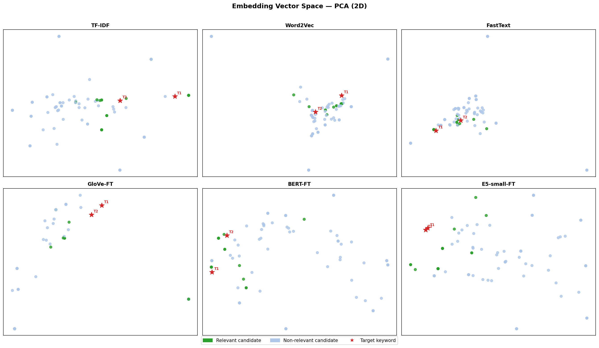
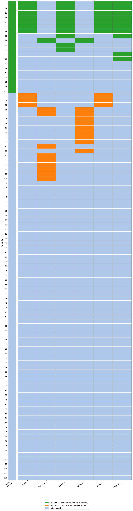

# Talent Spotting & Candidate Ranking System

> An end-to-end NLP pipeline that benchmarks six embedding strategies, from classical bag-of-words to fine-tuned transformers, augmented with a small language model scorer and a human-in-the-loop feedback mechanism, to automatically surface the most relevant HR candidates from a raw applicant pool.

---

## Table of Contents

1. [Project Overview](#1-project-overview)
2. [Problem Statement](#2-problem-statement)
3. [Project Pipeline: Step by Step](#3-project-pipeline-step-by-step)
   - [Step 1: Data Loading](#step-1-data-loading)
   - [Step 2: Data Cleaning and Preprocessing](#step-2-data-cleaning-and-preprocessing)
   - [Step 3: Embedding and Similarity Scoring](#step-3-embedding-and-similarity-scoring)
   - [Step 4: Candidate Ranking](#step-4-candidate-ranking)
   - [Step 5: Re-ranking with Recruiter Feedback](#step-5-re-ranking-with-recruiter-feedback)
   - [Step 6: LLM-based Scoring](#step-6-llm-based-scoring)
   - [Step 7: Evaluation](#step-7-evaluation)
   - [Step 8: Visualization](#step-8-visualization)
4. [Embedding Methods Compared](#4-embedding-methods-compared)
5. [Key Design Decisions](#5-key-design-decisions)
6. [Project Structure](#6-project-structure)
7. [How to Run](#7-how-to-run)
8. [Results and Visualizations](#8-results-and-visualizations)
9. [Concluding Remarks for Hiring Managers and Recruiters](#9-concluding-remarks-for-hiring-managers-and-recruiters)

---

## 1. Project Overview

This project builds an **intelligent candidate ranking system** for a real recruiting use case. Given a dataset of 104 candidates with free-text job titles and LinkedIn connection counts, the system automatically ranks them by how well they fit the profile of someone *aspiring to or seeking a Human Resources role*.

The core contribution is a **systematic benchmark of six embedding strategies**, from TF-IDF to fine-tuned transformer models, implemented, compared, and evaluated against recruiter-provided ground truth. On top of that, the project integrates a 500M-parameter language model as an independent scorer and demonstrates a feedback-driven re-ranking loop that improves as recruiters interact with results.

Every hyperparameter in this pipeline was validated by grid search. Every design decision is justified in code comments and documentation. The result is not just a working system; it is a transparent, reproducible investigation into what makes NLP-based candidate ranking work in practice.

---

## 2. Problem Statement

A recruiter has a pool of candidates and two target search phrases:

- `"aspiring human resources"`
- `"seeking human resources"`

**Goal:** Automatically rank every candidate by fit for an HR role, placing the most relevant candidates at the top of the list.

**Challenges addressed:**

| Challenge | How it is handled |
|---|---|
| Varied phrasing across job titles | Semantic similarity via transformer embeddings |
| Synonym mismatch (`"HR"` vs `"Human Resources"`) | Dense vector spaces that encode meaning, not just tokens |
| Long titles diluting keyword signals | MAX cosine similarity across targets instead of average |
| Connection count as a noisy secondary signal | Normalized and blended at a grid-search-validated weight |
| Static rankings that do not improve over time | Human-in-the-loop re-ranking from recruiter-starred feedback |

---

## 3. Project Pipeline: Step by Step

```
Raw CSV Data
     │
     ▼
┌─────────────────┐
│  Data Loading   │  load_data()
└────────┬────────┘
         │
         ▼
┌─────────────────────────────┐
│  Cleaning & Preprocessing   │  preprocess()
│  - Clean job titles         │
│  - Parse connection counts  │
│  - Normalize connections    │
└────────────┬────────────────┘
             │
             ▼
┌────────────────────────────────────────┐
│  Embedding & Similarity Scoring        │  compare_embeddings.py
│  (6 methods benchmarked in parallel)   │
│  TF-IDF → Word2Vec → FastText →        │
│  GloVe-FT → BERT-FT → E5-small-FT     │
└────────────┬───────────────────────────┘
             │
             ▼
┌──────────────────────────────────────┐
│  Candidate Ranking                   │  ranking.py
│  fit = 0.7 × title_sim               │
│       + 0.3 × connections_norm       │
└────────────┬─────────────────────────┘
             │
             ▼
┌──────────────────────────────────────┐
│  Re-ranking with Recruiter Feedback  │  reranking.py
│  Blend similarity-to-starred into    │
│  the fit score (α = 0.9)             │
└────────────┬─────────────────────────┘
             │
             ▼
┌──────────────────────────────────────┐
│  LLM Scoring                         │  llm_ranking.py
│  Qwen2.5-0.5B-Instruct scores each   │
│  title 0.0–1.0 for HR fit            │
└────────────┬─────────────────────────┘
             │
             ▼
┌──────────────────────────────────────┐
│  Evaluation & Visualization          │  evaluation.py
│  NDCG@k · PCA · t-SNE · Score Grid  │
└──────────────────────────────────────┘
```

---

### Step 1: Data Loading

**File:** `src/data_loader.py`

The raw dataset (`data/PotentialTalents.csv`) contains 104 candidate records with:

| Column | Description |
|---|---|
| `id` | Unique candidate identifier |
| `job_title` | Free-text LinkedIn-style job title |
| `connection` | LinkedIn connection count (may include `"500+"`) |
| `fit` | Target column; initially empty, filled by the pipeline |

A single `load_data(path)` function reads the CSV into a pandas DataFrame. Keeping this stage isolated makes it trivial to swap in a different data source without touching any downstream logic.

---

### Step 2: Data Cleaning and Preprocessing

**File:** `src/preprocessing.py`

| Operation | Implementation detail |
|---|---|
| Job title cleaning | Preserved as-is; BERT and E5 handle casing and punctuation internally, and over-cleaning degrades transformer semantics |
| Connection parsing | `"500+"` is capped at 500; invalid or missing values default to 0 |
| Connection normalization | Linearly scaled to `[0, 1]` by dividing by 500 |

`TARGETS_CLEAN`, the cleaned target phrases, is shared across all six embedding methods so every comparison uses an identical query.

---

### Step 3: Embedding and Similarity Scoring

**File:** `src/compare_embeddings.py`

The analytical core of the project. Each of the six methods follows an identical contract:

1. Embed all candidate job titles, producing a matrix of shape `(104 × dim)`
2. Embed the two target keywords, producing a matrix of shape `(2 × dim)`
3. Compute cosine similarity between every candidate and every target
4. Score = **MAX** similarity across both targets

Using MAX rather than average ensures that a candidate title containing one highly relevant phrase is not penalized for surrounding context. This produces a single scalar `fit` score per candidate for each method, enabling a direct, fair comparison across all six approaches.

---

### Step 4: Candidate Ranking

**File:** `src/ranking.py`

Raw similarity is blended with network strength into a single fit score:

```
fit = 0.7 × title_similarity + 0.3 × connections_norm
```

The `0.7 / 0.3` split was confirmed optimal by grid search. Title relevance dominates; connections act as a principled tie-breaker rather than a dominant factor.

---

### Step 5: Re-ranking with Recruiter Feedback

**File:** `src/reranking.py`

When a recruiter stars candidates they approve of, those selections become a live feedback signal. The re-ranker:

1. Encodes all titles and all starred titles using `all-MiniLM-L6-v2`
2. Computes each candidate's mean cosine similarity to the starred set
3. Blends into the existing fit score:

```
fit_new = (1 - α) × fit_old + α × starred_similarity     [α = 0.9]
```

`α = 0.9` was validated by grid search: once recruiter feedback is available, it is a far stronger signal than the original blended score. This module demonstrates a **human-in-the-loop** design pattern; the system improves continuously as recruiters interact with it.

---

### Step 6: LLM-based Scoring

**File:** `src/llm_ranking.py`

`Qwen2.5-0.5B-Instruct` (500M parameters) scores each job title independently of the embedding pipeline:

- **Prompt strategy (zero-shot):** *"Score from 0.0 to 1.0 how well this job title matches someone aspiring and seeking a human resources position."*
- **Decoding:** Greedy (`do_sample=False`), ensuring deterministic, reproducible scores
- **Output parsing:** Regex extracts the decimal score; result clamped to `[0.0, 1.0]`
- **Config persistence:** `GenerationConfig` serialized to `models/qwen-ranking/generation_config.json`

Three prompt strategies were explored and documented in code: zero-shot, few-shot, and chain-of-thought, with zero-shot selected as the cleanest baseline. This section demonstrates practical LLM integration: prompt engineering, chat template formatting, generation config management, and output parsing.

---

### Step 7: Evaluation

**File:** `src/evaluation.py`

Rankings are evaluated with **NDCG@k** (Normalized Discounted Cumulative Gain), the standard information retrieval metric for ranked lists:

```
DCG@k  = Σ(i=1 to k)  relevance_i / log₂(i + 2)
IDCG@k = DCG of the perfect ranking (all 20 starred candidates in positions 1-20)
NDCG@k = DCG@k / IDCG@k          (range: 0.0 to 1.0)
```

A score of 1.0 means every recruiter-starred candidate appeared in the top results. NDCG captures rank position: burying a relevant candidate at position 40 is penalized more than placing it at position 21.

---

### Step 8: Visualization

**File:** `src/compare_embeddings.py`, functions `visualize()` and `plot_all_scores()`

| Output | What it shows |
|---|---|
| `embedding_space_pca.png` | PCA 2D projection of all six embedding spaces; reveals global structure and how well each method clusters relevant candidates near the target keywords |
| `embedding_space_tsne.png` | t-SNE 2D projection; reveals local cluster quality and how tightly relevant candidates group together |
| `all_scores.png` | Binary selection grid: 6 method columns by 104 candidate rows, color-coded as TP (green), FP (orange), or not selected (blue) |

Color scheme across all plots: **green** = recruiter-starred candidate, **light blue** = not relevant, **red star** = target keyword.

---

## 4. Embedding Methods Compared

| Method | Corpus | Vector dim | Parameters | Key characteristic |
|---|---|---|---|---|
| **TF-IDF** | Our data only | ~312 (vocab size) | 312 IDF weights | Bag-of-words; penalizes long titles; cannot handle synonyms |
| **Word2Vec** | Our data only | 100 | ~62,400 | Dense word semantics; corpus too small to learn meaningful HR relationships |
| **FastText** | Our data only | 100 | ~400M | Subword n-grams handle morphological variants; still bottlenecked by a ~100-title corpus |
| **GloVe + Mittens** | Wikipedia + fine-tuned | 100 | ~40M | Pretrained global co-occurrences, nudged toward job-title vocabulary via Mittens |
| **BERT + SimCSE** | Pretrained + fine-tuned | 384 | 22.7M | Full sentence context via self-attention; domain-adapted with unsupervised SimCSE |
| **E5-small + SimCSE** | Pretrained + fine-tuned | 384 | 33.4M | Retrieval-optimized; asymmetric `query:` / `passage:` encoding designed for IR tasks |

**Key takeaway:** More parameters do not guarantee better results. FastText has 400M+ parameters yet performs poorly because it was trained on only ~100 job titles. BERT and E5 are smaller but consistently outperform classical methods because their parameters encode knowledge from billions of sentences.

---

## 5. Key Design Decisions

| Decision | Rationale |
|---|---|
| SimCSE fine-tuning for BERT and E5 | Domain-adapts pretrained transformers without any labelled data; each sentence is its own positive pair under different dropout masks |
| Mittens fine-tuning for GloVe | Bridges the Wikipedia-to-job-title vocabulary gap at very low compute cost, without full retraining |
| MAX cosine similarity (not average) | A candidate with one highly relevant phrase in a long title should not be penalized; MAX captures the best-matching alignment with either target keyword |
| `w = 0.7` for ranking blend | Grid-search validated; title relevance dominates, connections provide a meaningful but secondary signal |
| `α = 0.9` for re-ranking blend | Grid-search validated; starred-candidate similarity is the dominant signal once recruiter feedback is available |
| Greedy decoding for LLM scorer | Ensures identical inputs always produce identical scores, essential for fair benchmarking |
| NDCG@k for evaluation | Standard IR metric; accounts for rank position, not just presence in the top-k set |

---

## 6. Project Structure

```
.
├── main.py                    # Entry point: runs the full pipeline end-to-end
├── data/
│   └── PotentialTalents.csv   # Raw candidate dataset (104 records)
├── models/
│   └── qwen-ranking/
│       └── generation_config.json   # Serialized LLM generation config
├── outputs/
│   ├── embedding_space_pca.png
│   ├── embedding_space_tsne.png
│   └── all_scores.png
├── src/
│   ├── config.py              # Central config: file paths, model IDs, hyperparameters, ground truth
│   ├── data_loader.py         # CSV ingestion
│   ├── preprocessing.py       # Title cleaning, connection parsing and normalization
│   ├── compare_embeddings.py  # All 6 embedding methods + PCA/t-SNE visualizations
│   ├── ranking.py             # Blended fit scoring (title similarity + connections)
│   ├── reranking.py           # Human-in-the-loop re-ranking via recruiter feedback
│   ├── llm_ranking.py         # Qwen2.5-0.5B-Instruct scorer
│   ├── evaluation.py          # NDCG@k evaluation metric
│   └── analysis.py            # Notebook-friendly analysis helpers
└── notebooks/
    └── analysis.ipynb         # Interactive exploration and result inspection
```

---

## 7. How to Run

**1. Install dependencies**

```bash
pip install -r requirements.txt
```

**2. Set your Hugging Face token** (required for Qwen model download)

```bash
echo "HUGGING_FACE_API_KEY=your_token_here" > .env
```

**3. Run the full pipeline**

```bash
python main.py
```

This will:
- Load and preprocess the 104-candidate dataset
- Run all six embedding methods and print the top-10 candidates for each
- Generate PCA and t-SNE embedding space visualizations
- Run the Qwen LLM scorer and produce a score bar chart
- Generate the all-methods binary selection comparison grid

---

## 8. Results and Visualizations

### Embedding Space: PCA


### Embedding Space: t-SNE


### All Methods: Score Comparison Grid


> **Green:** model selected the candidate AND recruiter starred them (true positive)
> **Orange:** model selected the candidate but recruiter did NOT star them (false positive)
> **Blue:** candidate not selected by this method

---

## 9. Concluding Remarks for Hiring Managers and Recruiters

### What this project demonstrates

This is an **original end-to-end NLP engineering investigation**, not a tutorial or course reproduction. It covers the full machine learning development lifecycle with deliberate, documented decisions at every stage.

**Problem framing.** A vague recruiting task ("find relevant HR candidates") is translated into a well-defined information retrieval problem: a ranked list evaluated by NDCG@k against recruiter-provided ground truth. This kind of problem translation is a core skill that distinguishes engineers who deliver value from those who need tasks fully specified.

**Comparative analysis across six methods.** Rather than picking a single model, the project systematically benchmarks TF-IDF, Word2Vec, FastText, GloVe (with Mittens fine-tuning), BERT (with SimCSE fine-tuning), and E5-small (with SimCSE fine-tuning). Each method's failure modes are explained honestly in terms of the specific characteristics of this dataset, not just listed as abstract limitations.

**Principled, data-validated engineering.** Every hyperparameter (`w = 0.7`, `α = 0.9`) was confirmed by grid search, not chosen by intuition. Generation configs are serialized for reproducibility. Code is modular, with single-responsibility source files and a central config that makes the system easy to extend.

**Human-in-the-loop architecture.** The re-ranking module reflects an understanding that production ML systems are not static artifacts. Rankings improve as recruiters star candidates, turning the system into a feedback loop rather than a one-shot classifier. This design pattern is directly applicable to real-world recruiting tools.

**LLM integration at a practical level.** The Qwen2.5 scorer demonstrates hands-on experience beyond API calls: chat template formatting, prompt strategy selection (zero-shot vs. few-shot vs. chain-of-thought), generation config management, greedy decoding for reproducibility, and regex-based output parsing.

**Stakeholder-ready visualization.** PCA projections, t-SNE cluster plots, and a binary selection grid translate abstract embedding mathematics into visuals that are interpretable without a machine learning background; a critical skill for anyone working at the intersection of ML and business.

---

### Skills demonstrated

`Python` · `NLP` · `Information Retrieval` · `Sentence Transformers` · `Hugging Face Transformers` · `scikit-learn` · `gensim` · `TF-IDF` · `Word2Vec` · `FastText` · `GloVe` · `Mittens` · `BERT` · `E5` · `SimCSE` · `LLM Prompting` · `Qwen2.5` · `NDCG` · `PCA` · `t-SNE` · `Matplotlib` · `Pandas` · `NumPy` · `Reproducible ML`

---

*Built as a deep-dive into NLP-based candidate ranking, exploring the practical trade-offs between classical and neural embedding methods in a real recruiting context.*
